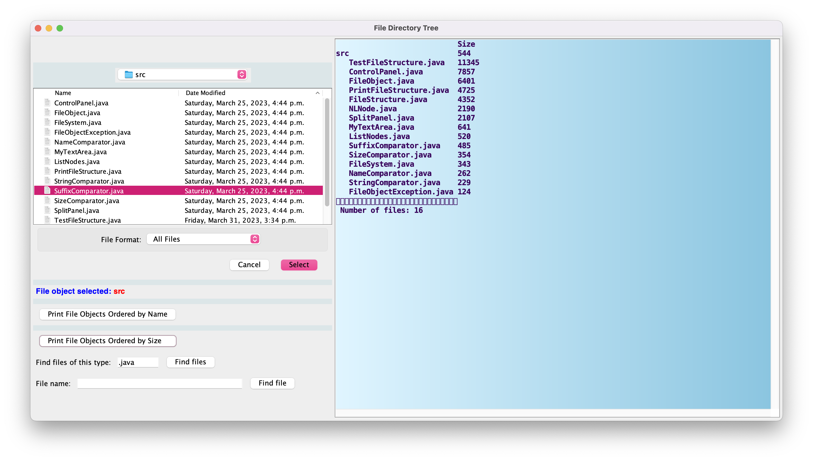
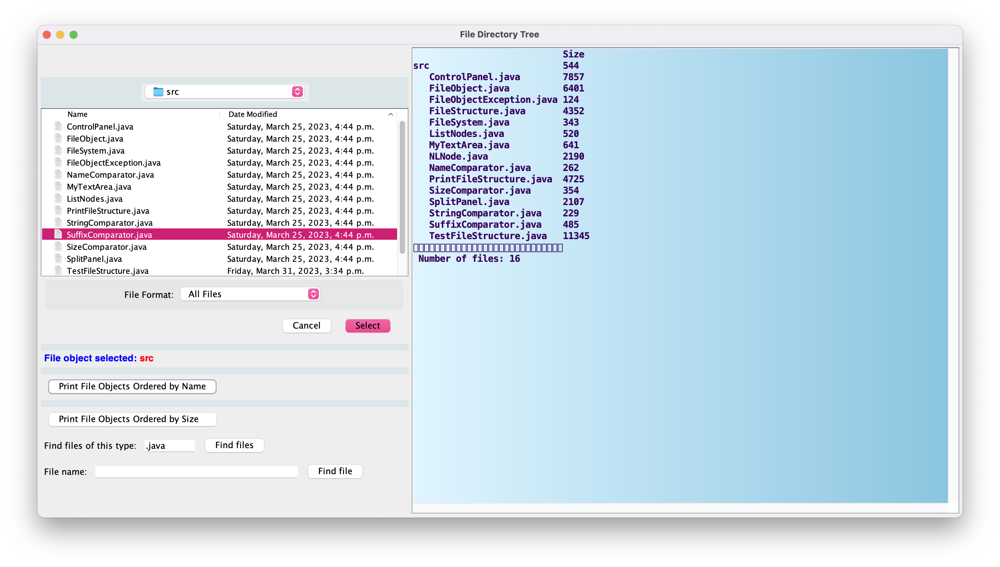
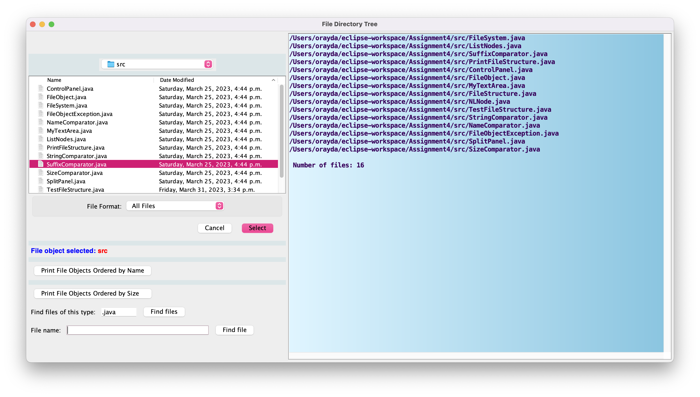

# FileSystem
This program is a file system that allows the user to search for file names locally, list file names sorted by date or size, and list files of specified type. The program uses concepts such as linked lists, recursion, objects, generics and data structures. 

# Demo

# Technical Stack
Java
